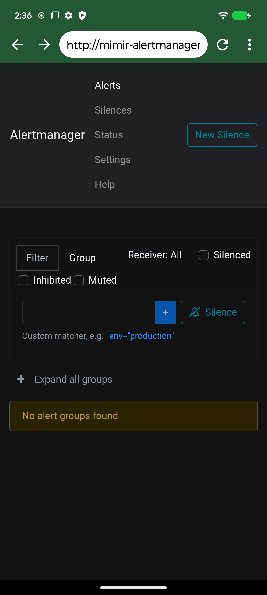

# NB Browser

Android web browser that routes all traffic through an embedded
[NetBird](https://netbird.io) userspace client — no VPN service, no root, no
`VpnService`. It loads internal-only sites (Nomad, Consul, Grafana, …) that
are only reachable inside a NetBird network, as if they were normal websites.



## How it works

```
┌──────────────┐   http(s)    ┌───────────────────┐   DialContext    ┌──────────┐
│   WebView    │ ───────────▶ │  localhost proxy  │ ───────────────▶ │ NetBird  │
│ (chromium)   │   CONNECT /  │  (Go, netbird.io/ │    overlay net    │  engine │
│              │   absolute-  │   client/embed)   │                   │  (wg)    │
└──────────────┘    form GET  └───────────────────┘                   └──────────┘
```

- The Go facade (`nbproxy/`) starts the embedded NetBird engine and exposes a
  localhost HTTP proxy on a random port. `CONNECT` requests are blindly piped
  (TLS stays end-to-end, preserving SNI); plain `http://` requests are
  forwarded through the NetBird overlay via `httputil.ReverseProxy`.
- The app points the WebView at the proxy with
  [`ProxyController.setProxyOverride`](https://developer.android.com/reference/androidx/webkit/ProxyController)
  (`PROXY_OVERRIDE` feature).
- DNS is resolved by the NetBird DNS server inside the overlay, so internal
  hostnames just work.
- The management server URL and setup key are configured at runtime through
  the in-app settings (⚙ button) — nothing is baked into the APK.

## Repository layout

```
├── app/        Android app (Kotlin, WebView, ProxyController)
├── nbproxy/    Go module exposing the NetBird engine + proxy facade (gomobile)
└── .github/
    └── workflows/release.yml   Tag-triggered signed release pipeline
```

## Building locally

Prerequisites:

- Go ≥ 1.25.5 (with toolchain auto-switch, or set manually)
- JDK 17
- Android SDK (platform 34) + NDK 26.3.11579264
- [gomobile](https://pkg.go.dev/golang.org/x/mobile/cmd/gomobile)

```sh
# 1. Build the Go facade into an AAR
cd nbproxy
export PATH="$(go env GOPATH)/bin:$PATH"
export ANDROID_HOME=/path/to/android-sdk
export ANDROID_NDK_HOME=$ANDROID_HOME/ndk/26.3.11579264
gomobile bind -target=android/arm64 -androidapi 24 -o ../app/libs/nbproxy.aar .

# 2. Build the debug APK
cd ../app
./gradlew assembleDebug
```

The AAR is built by CI, so it is gitignored (`app/libs/*.aar`).

### Why the vendored `anet`?

`github.com/wlynxg/anet` used `//go:linkname` to Go's internal `net.zoneCache`,
which is rejected by modern Go toolchains. The patched copy in
`nbproxy/third_party/anet` (linked via a `replace` directive) removes those
directives. Don't bump `anet` without re-applying the patch.

## Release workflow

Push a tag to trigger the pipeline:

```sh
git tag v1.0.0
git push origin v1.0.0
```

`.github/workflows/release.yml` then:

1. builds `nbproxy.aar` with Go + gomobile,
2. builds a signed `assembleRelease` APK,
3. creates a GitHub release for the tag with the APK attached
   (`versionName` is derived from the tag).

### Required repository secrets

| Secret                | Value                                     |
| --------------------- | ----------------------------------------- |
| `KEYSTORE_BASE64`     | base64 of `release.keystore`              |
| `KEYSTORE_PASSWORD`   | keystore password                         |
| `KEY_ALIAS`           | key alias (e.g. `nb-browser`)             |
| `KEY_PASSWORD`        | key password                              |

Generate a keystore with:

```sh
keytool -genkeypair -v -keystore release.keystore -alias nb-browser \
  -keyalg RSA -keysize 4096 -validity 10000 \
  -storepass "$PASS" -keypass "$PASS" -dname "CN=NB Browser, O=you, C=FR"
base64 -w0 release.keystore
```

**Keep the keystore safe — it cannot be recovered and is required to sign
future updates.** It is gitignored; never commit it.